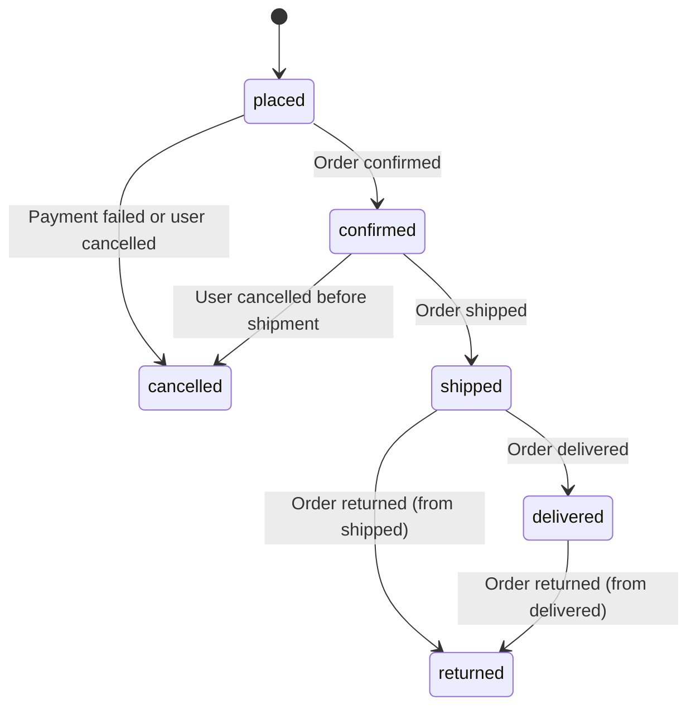
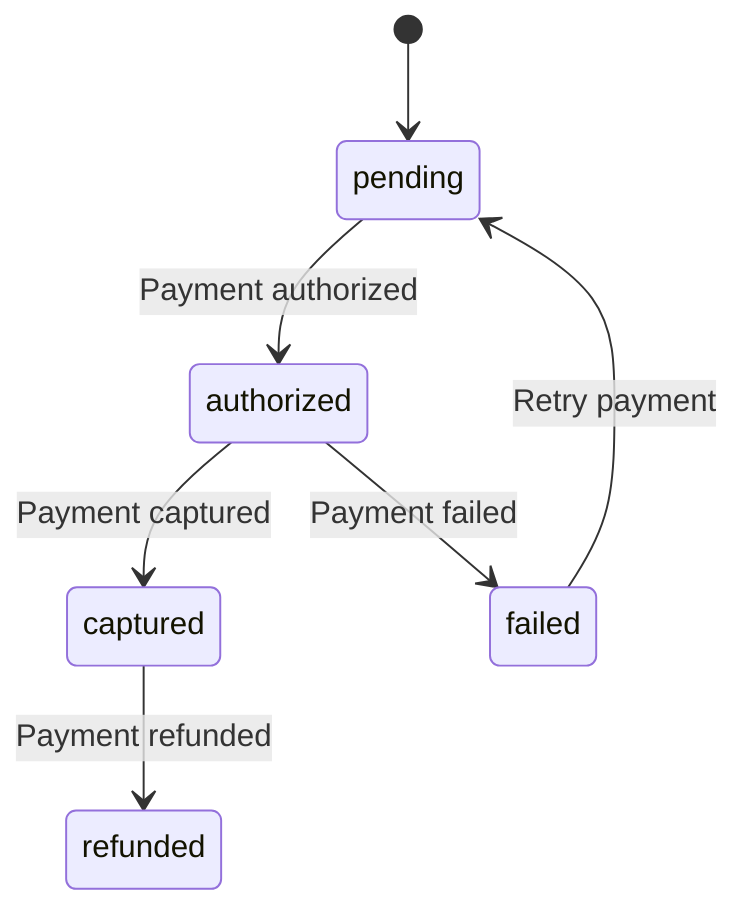

# Simulator State Machine Specification

## Overview
This document defines the state machine for the e-commerce simulator, covering both **order lifecycle** and **payment processing**. The state machine models:
1. Order progression from placement to final status (delivered or returned).
2. Payment states (pending, authorized, captured, refunded).

## States

### Order States

| State      | Description                                                                                     |
|------------|-------------------------------------------------------------------------------------------------|
| `placed`   | Order created and awaiting confirmation.                                                        |
| `confirmed`| Order confirmed and being processed for fulfillment.                                             |
| `cancelled`| Order cancelled before shipment (payment refused or user-initiated). Terminal state.            |
| `shipped`  | Order shipped and in transit to customer.                                                        |
| `delivered`| Order delivered to customer. Not terminal — can transition to `returned`.                        |
| `returned` | Order returned by customer. Terminal state.                                                      |

### Payment States

| State          | Description                                                                                     |
|----------------|-------------------------------------------------------------------------------------------------|
| `pending`      | Payment initiated but not yet authorized.                                                       |
| `authorized`   | Payment authorized but not yet captured.                                                        |
| `captured`     | Payment captured (funds transferred). Terminal state for successful payments.                   |
| `refunded`     | Payment refunded to customer. Terminal state.                                                    |
| `failed`       | Payment failed or declined. Terminal state.

## Transitions

### Order Transitions

### Payment Transitions

### Combined Transition Rules

#### Order Transitions
1. **placed → confirmed**
   - Trigger: Order confirmation (automatic or manual).
   - Actions: Reserve inventory, notify customer.
   - **Payment**: Must transition to `authorized` (98%) or `failed` (2%).

2. **placed → cancelled**
   - Trigger: Payment failed (2%) or user cancelled (1%).
   - Actions: Release inventory, notify customer.
   - **Payment**: Must be `failed`.

3. **confirmed → shipped**
   - Trigger: Fulfillment completion (98%).
   - Actions: Generate shipping label, notify customer.
   - **Payment**: Must be `authorized` or `captured`.

4. **confirmed → cancelled**
   - Trigger: User cancelled before shipment (1%).
   - Actions: Release inventory, notify customer.
   - **Payment**: Transition to `refunded` if `authorized`.

5. **shipped → delivered**
   - Trigger: Delivery confirmation (96%).
   - Actions: Update inventory, notify customer.
   - **Payment**: Must be `captured` (auto-capture if not already done).

6. **shipped → returned**
   - Trigger: Customer initiates return (3%).
   - Actions: Process refund, update inventory.
   - **Payment**: Transition to `refunded`.

7. **delivered → returned**
   - Trigger: Customer initiates return (3%).
   - Actions: Process refund, update inventory.
   - **Payment**: Transition to `refunded`.

8. **Random failures**
   - 1% of orders may fail to transition and remain stuck in `placed`, `confirmed`, or `shipped`.

#### Payment Transitions
1. **pending → authorized**
   - Trigger: Payment gateway authorization success.
   - Actions: Hold funds, update payment status.

2. **authorized → captured**
   - Trigger: Order shipped or manual capture.
   - Actions: Transfer funds, update payment status.

3. **authorized → failed**
   - Trigger: Payment gateway authorization failure.
   - Actions: Release held funds, notify customer.

4. **captured → refunded**
   - Trigger: Order returned or manual refund.
   - Actions: Refund funds, update payment status.

5. **failed → pending**
   - Trigger: Customer retries payment (50% chance, max 3 retries).
   - Actions: Re-initiate payment flow. After 3 retries, `failed` becomes terminal.

## Implementation Notes
- States and transitions for **both order and payment** will be implemented in `simulator/state_machine.py`.
- **Terminal states**: `returned`, `cancelled`, `captured`, `refunded`, `failed` (after 3 retries). **Non-terminal**: `delivered`.
- All transitions must emit events for logging and analytics.
- Payment state changes must be atomic with order state changes (e.g., `shipped` → `delivered` requires payment `capture`).

## Transition Probabilities

### Order Transitions
| Transition               | Probability | Notes                                                                       |
|--------------------------|-------------|-----------------------------------------------------------------------------|
| `placed` → `confirmed`   | 97%         | 97% of orders proceed to confirmation (2% payment failure, 1% user cancel). |
| `placed` → `cancelled`   | 3%          | 2% payment failure, 1% user-initiated cancel.                              |
| `confirmed` → `shipped`  | 98%         | 98% of confirmed orders ship (1% user cancel, 1% random failure).           |
| `confirmed` → `cancelled`| 2%          | 1% user-initiated cancel, **1% random failure (stuck)**.                   |
| `shipped` → `delivered`  | 96%         | 96% of shipped orders are delivered.                                        |
| `shipped` → `returned`   | 3%          | 3% of shipped orders are returned.                                          |
| `shipped` → stuck        | 1%          | 1% random failure — order remains in `shipped` state.                       |
| `delivered` → `returned` | 3%          | 3% of delivered orders are returned. **Note**: `delivered` is not terminal. |
| Random failures          | 1%          | 1% of orders may fail to transition and remain stuck in any non-terminal state.

### Payment Transitions
| Transition                   | Probability | Notes                                                                       |
|----------------------------|-------------|-----------------------------------------------------------------------------|
| `pending` → `authorized`    | 98%         | 2% of payments fail (e.g., declined, fraud).                                |
| `authorized` → `captured`   | 99%         | 1% of authorizations fail during capture (e.g., expired hold).              |
| `captured` → `refunded`     | 3%          | 3% of captured payments are refunded (matches order return rate).           |
| `authorized` → `failed`     | 1%          | 1% of authorizations fail (e.g., gateway timeout).                          |
| `failed` → `pending` (retry)| 50%         | 50% of failed payments are retried once.